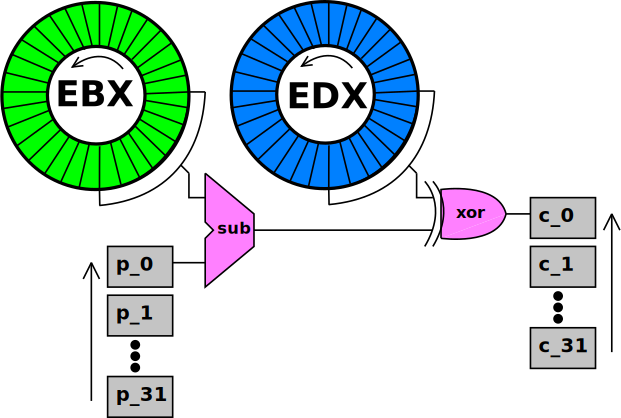

# Kao's Toy Project Solution

## Intro
Kao's "Toy Project" crackme has a bronze/silver/gold option for solving. Our main interest is in the algorithm by itself and how it can be solved using a SAT solver. We'll calculate the bronze key to meet the crackme's minimum requirements.  2 Algorithm  Let's get right into it:

```
.text:004010EC VerifySerial proc near                  ; CODE XREF: DialogFunc+104p 
.text:004010EC 
.text:004010EC ciphertext= byte ptr -21h 
.text:004010EC key0    = dword ptr  8 
.text:004010EC key1    = dword ptr  0Ch 
.text:004010EC 
.text:004010EC         push    ebp 
.text:004010ED         mov     ebp, esp 
.text:004010EF         add     esp, 0FFFFFFDCh 
.text:004010F2         mov     ecx, 20h                ; 32 loops 
.text:004010F7         mov     esi, offset plaintext   ; 32 bytes from HDD information 
.text:004010FC         lea     edi, [ebp+ciphertext] 
.text:004010FF         mov     edx, [ebp+key0] 
.text:00401102         mov     ebx, [ebp+key1] 
.text:00401105 
.text:00401105 more:                                   ; CODE XREF: VerifySerial+23j 
.text:00401105         lodsb 
.text:00401106         sub     al, bl 
.text:00401108         xor     al, dl 
.text:0040110A         stosb 
.text:0040110B         rol     edx, 1 
.text:0040110D         rol     ebx, 1 
.text:0040110F         loop    more                    ; 
.text:0040110F                                         ; 
.text:00401111         mov     byte ptr [edi], 0 
.text:00401114         push    offset String2          ; "0how4zdy81jpe5xfu92kar6cgiq3lst7" 
.text:00401119         lea     eax, [ebp+ciphertext] 
.text:0040111C         push    eax                     ; lpString1 
.text:0040111D         call    lstrcmpA 
.text:00401122         leave 
.text:00401123         retn    8 
.text:00401123 VerifySerial endp
```

Here the algorithm in Python. Now we can work in Linux where our SAT tools reside. 

```python
#!/usr/bin/python
def rol(a):
    return ((a&gt;&gt;31) | (a&lt;&lt;1)) &amp; 0xFFFFFFFF;
def sub(a,b):
    return (a-b) &amp; 0xFF;

# for input serial "DEADBEEF-14530451"
edx = 0xDEADBEEF
ebx = 0xCAFEBABE

plain = [0xB7, 0x68, 0x83, 0x6E, 0x97, 0x20, 0xD1, 0xF2, \
         0xAF, 0x9E, 0x35, 0xCF, 0x1C, 0xCA, 0x87, 0x99, \
         0xAB, 0x05, 0xCC, 0x9A, 0xCB, 0x46, 0xBF, 0x74, \
         0x49, 0x38, 0x13, 0x57, 0xA4, 0xA3, 0xD5, 0x76]

output = []

for i in range(32):
    temp = sub(plain[i], ebx &amp; 0xFF)
    temp = temp ^ (edx &amp; 0xFF)
    print '%02X ' % temp,
    edx = rol(edx)
    ebx = rol(ebx)
```

I like to think of the algorithm as a stream cipher. EDX and EBX are loaded with the 64-bit key. Every byte of plaintext gets mapped to one byte of ciphertext. The mapping is simple: BL is subtracted, and DL is xor'd. Before the next byte is processed, EDX and EBX are both rotated left. Here is an illustration of the process:



In the crackme, this stream cipher processes exactly 32 bytes. The input stream is calculated from your HDD information, and presented as the unlock code. Then unlock code for the bronze crackme is:

`6E8368B7F2D12097-CF359EAF9987CA1C-9ACC05AB74BF46CB-5713384976D5A3A4`

Which expands to the 32-byte input stream:
`B7 68 83 6E 97 20 D1 F2 AF 9E 35 CF 1C CA 87 99 AB 05 CC 9A CB 46 BF 74 49 38 13 57 A4 A3 D5 76`

The hardcoded ciphertext that must result from encryption is:
`30 68 6f 77 34 7a 64 79 38 31 6a 70 65 35 78 66 75 39 32 6b 61 72 36 63 67 69 71 33 6c 73 74 37`

Our job as the keygenner is to supply the key, the EDX, EBX pair such that encryption of the bronze unlock code results in the hardcoded ciphertext.

## Analysis

 First, try to solve the problem by hand a bit to develop a feel of the difficulty of the problem. For any single byte pair of plaintext and ciphertext (pi, c_i) it's quite easy to find 8 bits within the key so that the mapping is correct. In fact, you can choose ANY byte in EBX to subtract, since you can adjust the difference via the xor by the corresponding byte in EDX.

<span style="color:red">So the value of the key for each byte mapping is completely open ended (256 possibilities). But actually choosing a value for the key for that mapping propogates a constraint across the possibilities of the other parts of the key. And this is the beauty of the algorithm.</span>

Perhaps now you already "feel" a similarity with SAT. It's very simple to satisfy a single clause, but that choice of literals immediately constrains the choices available for making satisfying assignments of literals in the other clauses. Most importantly, you can't know that a successive path of assignments will lead to a conflict until you actually commit to those assignments and search onwards.

There is no algebra between arithmetic addition/subtraction and the xor operation so we can't hope to algebraically manipulate the equations and factor out any work.

It's also worth knowing that the key space isn't quite 32-bits. We can calculate a dependency between the bits in EBX and EDX quite easily by analyzing what happens during the add, xor process on the lowest bit of each of the 32 mappings.

Subtraction can be transferred to addition of the complemented subtrahend, plus 1. Ignoring the carry to higher-order bits, the least significant sum bit can be written:

`EDX0 ^ /EBX0 ^ 1 = OutByte0`

Thus we can loop over all 32 bytes of the fixed ciphertext and determine this dependency for each of the 32 bits of the key. Knowing EDX completely determines EBX, and visa-versa.

## SAT

 We purposely do NOT use the dependency and leave the key space open at 64-bits. We're curious if the SAT solver can easily "see" the dependency within the equations we generate.

We have no elegant conversion, despite our feeling that this problem is similar to SAT. So we get dirty, dropping in combinatorial logic for a real adder and a parallel xor'er. We generation an 8-bit circuit for each of the 32 bytes of output, resulting in 256 equations.

The adder is the simple ripple-carry variety with carry input. The first addend is the plaintext byte, and the second addend is the complemented DL byte. For the 2's complement conversion to be complete, we require an extra unit of addition, but we do this by initializing the adder's carry input to 1. The resulting equations are:

```
sum0=((plain0^/BL0)^1) sum1=((plain1^/BL1)^((plain0^/BL0)+(/BL0*plain0))) sum2=((plain2^/BL2)^(((plain1^/BL1)*((plain0^/BL0)+(/BL0*plain0)))+(/BL1*plain1))) sum3=((plain3^/BL3)^(((plain2^/BL2)*(((plain1^/BL1)*((plain0^/BL0)+(/BL0*plain0)))+(/BL1*plain1)))+(/BL2*plain2))) sum4=((plain4^/BL4)^(((plain3^/BL3)*(((plain2^/BL2)*(((plain1^/BL1)*((plain0^/BL0)+(/BL0*plain0)))+(/BL1*plain1)))+(/BL2*plain2)))+(/BL3*plain3))) sum5=((plain5^/BL5)^(((plain4^/BL4)*(((plain3^/BL3)*(((plain2^/BL2)*(((plain1^/BL1)*((plain0^/BL0)+(/BL0*plain0)))+(/BL1*plain1)))+(/BL2*plain2)))+(/BL3*plain3)))+(/BL4*plain4))) sum6=((plain6^/BL6)^(((plain5^/BL5)*(((plain4^/BL4)*(((plain3^/BL3)*(((plain2^/BL2)*(((plain1^/BL1)*((plain0^/BL0)+(/BL0*plain0)))+(/BL1*plain1)))+(/BL2*plain2)))+(/BL3*plain3)))+(/BL4*plain4)))+(/BL5*plain5))) sum7=((plain7^/BL7)^(((plain6^/BL6)*(((plain5^/BL5)*(((plain4^/BL4)*(((plain3^/BL3)*(((plain2^/BL2)*(((plain1^/BL1)*((plain0^/BL0)+(/BL0*plain0)))+(/BL1*plain1)))+(/BL2*plain2)))+(/BL3*plain3)))+(/BL4*plain4)))+(/BL5*plain5)))+(/BL6*plain6)))
```

Each of these sum values is then xor'd with DL, and we desire the value to be the ciphertext byte ci. So as a full example, we'll write the equations so that ebx's low byte and edx's low byte get mapped to the first byte of ciphertext: 0x30. Note some simplification have been applied to reduce circuit size.

```
0=(/ebx0^edx0) 0=((ebx1^(ebx0+/ebx0))^edx1) 0=((ebx2^((ebx1*(ebx0+/ebx0))+/ebx1))^edx2) 0=((/ebx3^((ebx2*((ebx1*(ebx0+/ebx0))+/ebx1))+/ebx2))^edx3) 1=((ebx4^(/ebx3*((ebx2*((ebx1*(ebx0+/ebx0))+/ebx1))+/ebx2)))^edx4) 1=((ebx5^((ebx4*/ebx3*((ebx2*((ebx1*(ebx0+/ebx0))+/ebx1))+/ebx2))+/ebx4))^edx5) 0=((/ebx6^((ebx5*((ebx4*/ebx3*((ebx2*((ebx1*(ebx0+/ebx0))+/ebx1))+/ebx2))+/ebx4))+/ebx5))^edx6) 0=((ebx7^(/ebx6*((ebx5*((ebx4*/ebx3*((ebx2*((ebx1*(ebx0+/ebx0))+/ebx1))+/ebx2))+/ebx4))+/ebx5)))^edx7)
```

## Actually Solving

Now we must just generate these equations for each of the 32 mappings. The full listing is [ here](file:///Users/andrewl/repos/lwerdna/crackme/kao_s_toy_project_solution/solution_andrewl/circuit_equs.txt). By the way, this isn't happening by hand. Circuit building and other SAT tools exist now in my  keygenning library [kglib](file:///Users/andrewl/repos/lwerdna/crackme/kao_s_toy_project_solution/solution_andrewl/kglib.py). The code to invoke it so that this circuit is built  becomes rather small:

```python
kglib = reload(kglib)
plain = [0xB7, 0x68, 0x83, 0x6E, 0x97, 0x20, 0xD1, 0xF2, 0xAF, 0x9E, 0x35, 0xCF, 0x1C, 0xCA, 0x96, 0x99, \
         0xAB, 0x05, 0xCC, 0x9A, 0xCB, 0x46, 0xBF, 0x74, 0x49, 0x38, 0x13, 0x57, 0xA4, 0xA3, 0xD5, 0x76]
ciphr = [0x30, 0x68, 0x6f, 0x77, 0x34, 0x7a, 0x64, 0x79, 0x38, 0x31, 0x6a, 0x70, 0x65, 0x35, 0x78, 0x66, \
         0x75, 0x39, 0x32, 0x6b, 0x61, 0x72, 0x36, 0x63, 0x67, 0x69, 0x71, 0x33, 0x6c, 0x73, 0x74, 0x37]
bss = 32*[None]
for i in range(32):
    bitrange = [(-i+j)%32 for j in range(8)]
    bss[i] = kglib.BoolSystem(8)
    bss[i].bitEquVal(8, plain[i])
    bss[i].subtracter(map(lambda x: kglib.BoolParser("ebx%d" % x), bitrange))
    bss[i].xorer(map(lambda x: kglib.BoolParser("edx%d" % x), bitrange))
    bss[i].loadTargetsFromBits(8, ciphr[i])
```

As in the [solution to Shmoocon 2012 "Blocky"](file:///Users/andrewl/repos/lwerdna/crackme/kao_s_toy_project_solution/shmoocon_2012_blocky_writeup), we use the  [Tseitin Transformation](http://en.wikipedia.org/wiki/Tseitin-Transformation) to convert it to an instance of SAT. I won't repeat the details here. The code to do this through kglib is simple. We just join together all the equations from each byte mapping and SAT solve them simultaneously. 

```python
temp = reduce(lambda x,y: x+y, bss)
temp.satSolve()
```

Conversion takes forever, but solving is nearly instant. The system as 2719 variables and 7678 clauses! Here is the [input file](file:///Users/andrewl/repos/lwerdna/crackme/kao_s_toy_project_solution/solution_andrewl/system.dimacs) to PicoSat in dimacs format. Here are some statistics PicoSat provides when given the verbose flag:

```
c 13 iterations c 0 restarts (0 skipped) c 24 conflicts (11 uips = 45.8%) c 0 adc conflicts c 2719 dereferenced literals c 49 decisions (0 random = 0.00%, 0 assumptions) c 24 static phase decisions (0.9% of all variables) c 2124 fixed variables c 2914 learned literals c 0.0% deleted literals c 5035 antecedents (209.8 antecedents per clause) c 11718 propagations (239.1 propagations per decision) c 29072 visits (2.5 per propagation) c 18687 binary clauses visited (64.3% 1.6 per propagation) c 10385 ternary clauses visited (35.7% 0.9 per propagation) c 0 large clauses visited (0.0% 0.0 per propagation) c 16176 other true (55.6% of visited clauses) c 8722 other true in binary clauses (53.9%), 372 upper (4.3%) c 7454 other true in large clauses (46.1%), 1714 upper (23.0%) c 13316 ternary and large traversals (0.5 per visit) c 0 large traversals (0.0 per large visit) c 11794 assignments c 80.8% variables used c 0.0 seconds in library c 3.5 megaprops/second c 8.7 million visits per second c recycled 0.0 MB in 0 reductions c recycled 0.0 MB in 1 simplifications c 0.8 MB maximally allocated c 0.0 seconds total run time
```

I ran it several times to see if it would take longer, but it always said 0.0 seconds, so I can't get any better timing resolution than that without some effort. Oh yea, and we want to know what the answer was, right?

```
ebx0: 0 ebx1: 1 ebx10: 1 ebx11: 0 ebx12: 0 ebx13: 0 ebx14: 1 ebx15: 0 ebx16: 0 ebx17: 1 ebx18: 0 ebx19: 0 ebx2: 0 ebx20: 1 ebx21: 0 ebx22: 0 ebx23: 0 ebx24: 0 ebx25: 0 ebx26: 0 ebx27: 0 ebx28: 1 ebx29: 0 ebx3: 0 ebx30: 1 ebx31: 1 ebx4: 0 ebx5: 0 ebx6: 0 ebx7: 0 ebx8: 1 ebx9: 0 edx0: 1 edx1: 0 edx10: 0 edx11: 0 edx12: 0 edx13: 1 edx14: 1 edx15: 0 edx16: 0 edx17: 0 edx18: 1 edx19: 1 edx2: 1 edx20: 0 edx21: 1 edx22: 1 edx23: 1 edx24: 1 edx25: 1 edx26: 1 edx27: 0 edx28: 0 edx29: 1 edx3: 0 edx30: 1 edx31: 1 edx4: 0 edx5: 0 edx6: 0 edx7: 1 edx8: 1 edx9: 1
```

Which means `EDX = 0xD0124502` and `EBX = 0xE7EC6385`. The key is entered as two hex integers separated by a hyphen. The first integer goes into EDX, and the second into EBX, but after being xor'd with EDX. <span style="color:red">So the final key value is E7EC6385-37FE2687.</span> You can use this now to extract the source code from the crackme's crackme_source.zip.

## Conclusion

Another get exercise for SAT attack! Be on the lookout for Dcoder's algebraic attack. And also rolfr has me thinking abouT SMT solvers now. Here's the Download/link summary:

- [Kao's Toy Project Crackme](file:///Users/andrewl/repos/lwerdna/crackme/kao_s_toy_project_solution/solution_andrewl/toyproject.zip)
- [kglib library (contains SAT converter, PicoSat supplicant)](file:///Users/andrewl/repos/lwerdna/crackme/kao_s_toy_project_solution/solution_andrewl/kglib.py)
- [the generated circuit (before sat conversion)](file:///Users/andrewl/repos/lwerdna/crackme/kao_s_toy_project_solution/solution_andrewl/circuit_equs.txt)
- [the SAT instance in DIMACS format](file:///Users/andrewl/repos/lwerdna/crackme/kao_s_toy_project_solution/solution_andrewl/system.dimacs)
- [SAT on Wikipedia](http://en.wikipedia.org/wiki/Boolean_satisfiability_problem)
- [ripple-carry adder's on Wikipedia](http://en.wikipedia.org/wiki/Adder_(electronics)#Ripple_carry_adder)
- [Tseitin Transformation on Wikipedia](http://en.wikipedia.org/wiki/Tseitin-Transformation)
